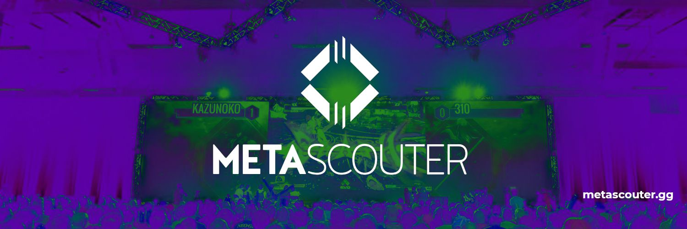

# Overview
Data analysis and insights from the [metascouter.gg](https://metascouter.gg/) Super Smash Brothers match analysis API. This initiative is currently in active development and affiliated with the Metascouter team.

## How it works
Metascouter is an automated esports data collection platform. Its service, stream and VOD processing powered by computer vision, is in beta release for Super Smash Brothers Melee (SSBM) and Super Smash Brothers Ultimate (SSBU), with access limited to early adopters as of April 3, 2020.

As of writing this, the functionality of Metascouter is limited to reading damage percentages. This, while a limited metric, yields significant insights into player advantage/disadvantage and style of play, and so we will use this as a starting point.
